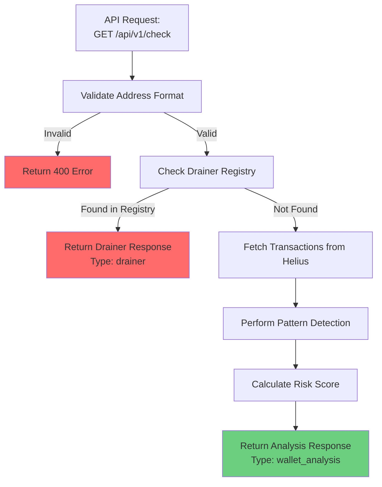

## Overview

The Have I Been Drained API provides REST endpoints for checking wallet security. This guide shows you how to integrate it into your application.

## Endpoints

### Unified Check Endpoint (Recommended)

**Endpoint:** `GET /api/v1/check`

**Use case:** Most common use case - checks drainer status first, then performs full analysis if needed.

The unified check endpoint follows this flow:



**Parameters:**
- `address` (required) - Solana wallet address
- `limit` (optional) - Transaction limit (default: 50, max: 200)
- `experimental` (optional) - Include experimental detections (default: false)

**Example:**
```bash
curl "https://api.haveibeendrained.org/api/v1/check?address=ABC123...&limit=50"
```

### Drainer Check Only

**Endpoint:** `GET /api/v1/drainer/:address`

**Use case:** Quick check if address is a known drainer (faster, no analysis).

**Example:**
```bash
curl "https://api.haveibeendrained.org/api/v1/drainer/ABC123..."
```

### Full Analysis Only

**Endpoint:** `GET /api/v1/analyze/:address`

**Use case:** Perform full wallet analysis (skips drainer check).

**Parameters:**
- `limit` (optional) - Transaction limit
- `experimental` (optional) - Include experimental detections

**Example:**
```bash
curl "https://api.haveibeendrained.org/api/v1/analyze/ABC123...?limit=100"
```

## Response Formats

### Drainer Response

```json
{
  "success": true,
  "type": "drainer",
  "data": {
    "drainerAddress": "ABC123...",
    "reportCount": 42,
    "firstSeen": "2024-01-15T10:30:00Z",
    "lastSeen": "2024-12-10T14:20:00Z",
    "totalSolReported": 150.5,
    "recentReporters": ["DEF456...", "GHI789..."]
  },
  "timestamp": 1702224000000
}
```

### Wallet Analysis Response

```json
{
  "success": true,
  "type": "wallet_analysis",
  "data": {
    "walletAddress": "ABC123...",
    "overallRisk": "AT_RISK",
    "riskScore": 65,
    "factors": [
      {
        "type": "unlimited_approval",
        "severity": "HIGH",
        "description": "Unlimited token approval detected"
      }
    ],
    "recommendations": [
      "Revoke unlimited approvals",
      "Check recent transactions"
    ],
    "checkedAt": "2024-12-10T14:20:00Z"
  },
  "timestamp": 1702224000000
}
```

### Error Response

```json
{
  "success": false,
  "error": "Invalid Solana address",
  "message": "The provided address is not a valid Solana address",
  "timestamp": 1702224000000
}
```

## Integration Examples

### JavaScript/Node.js

```javascript
class HaveIBeenDrained {
  constructor(apiKey = null) {
    this.baseUrl = 'https://api.haveibeendrained.org';
    this.apiKey = apiKey;
  }
  
  async check(address, options = {}) {
    const params = new URLSearchParams({
      address,
      limit: options.limit || 50,
      experimental: options.experimental || false
    });
    
    const headers = {
      'User-Agent': 'MyApp/1.0.0 (contact@example.com)'
    };
    
    if (this.apiKey) {
      headers['X-API-Key'] = this.apiKey;
    }
    
    const response = await fetch(
      `${this.baseUrl}/api/v1/check?${params}`,
      { headers }
    );
    
    if (!response.ok) {
      throw new Error(`API error: ${response.status}`);
    }
    
    return await response.json();
  }
  
  async checkDrainer(address) {
    const headers = {
      'User-Agent': 'MyApp/1.0.0 (contact@example.com)'
    };
    
    if (this.apiKey) {
      headers['X-API-Key'] = this.apiKey;
    }
    
    const response = await fetch(
      `${this.baseUrl}/api/v1/drainer/${address}`,
      { headers }
    );
    
    return await response.json();
  }
}

// Usage
const client = new HaveIBeenDrained('hibd_...');
const result = await client.check('ABC123...');

if (result.type === 'drainer') {
  console.log('⚠️ Known drainer detected!');
} else if (result.data.overallRisk === 'AT_RISK') {
  console.log('⚠️ Wallet at risk');
} else {
  console.log('✅ Wallet appears safe');
}
```

### Python

```python
import requests
from typing import Optional, Dict, Any

class HaveIBeenDrained:
    def __init__(self, api_key: Optional[str] = None):
        self.base_url = 'https://api.haveibeendrained.org'
        self.api_key = api_key
    
    def check(self, address: str, limit: int = 50, experimental: bool = False) -> Dict[str, Any]:
        headers = {
            'User-Agent': 'MyApp/1.0.0 (contact@example.com)'
        }
        
        if self.api_key:
            headers['X-API-Key'] = self.api_key
        
        params = {
            'address': address,
            'limit': limit,
            'experimental': experimental
        }
        
        response = requests.get(
            f'{self.base_url}/api/v1/check',
            params=params,
            headers=headers
        )
        
        response.raise_for_status()
        return response.json()
    
    def check_drainer(self, address: str) -> Dict[str, Any]:
        headers = {
            'User-Agent': 'MyApp/1.0.0 (contact@example.com)'
        }
        
        if self.api_key:
            headers['X-API-Key'] = self.api_key
        
        response = requests.get(
            f'{self.base_url}/api/v1/drainer/{address}',
            headers=headers
        )
        
        response.raise_for_status()
        return response.json()

# Usage
client = HaveIBeenDrained(api_key='hibd_...')
result = client.check('ABC123...')

if result['type'] == 'drainer':
    print('⚠️ Known drainer detected!')
elif result['data']['overallRisk'] == 'AT_RISK':
    print('⚠️ Wallet at risk')
else:
    print('✅ Wallet appears safe')
```

### Go

```go
package main

import (
    "encoding/json"
    "fmt"
    "net/http"
    "net/url"
)

type HaveIBeenDrained struct {
    BaseURL string
    APIKey  string
}

func (c *HaveIBeenDrained) Check(address string) (map[string]interface{}, error) {
    baseURL := "https://api.haveibeendrained.org"
    if c.BaseURL != "" {
        baseURL = c.BaseURL
    }
    
    params := url.Values{}
    params.Add("address", address)
    params.Add("limit", "50")
    
    req, err := http.NewRequest("GET", baseURL+"/api/v1/check?"+params.Encode(), nil)
    if err != nil {
        return nil, err
    }
    
    req.Header.Set("User-Agent", "MyApp/1.0.0 (contact@example.com)")
    if c.APIKey != "" {
        req.Header.Set("X-API-Key", c.APIKey)
    }
    
    client := &http.Client{}
    resp, err := client.Do(req)
    if err != nil {
        return nil, err
    }
    defer resp.Body.Close()
    
    var result map[string]interface{}
    json.NewDecoder(resp.Body).Decode(&result)
    
    return result, nil
}

// Usage
func main() {
    client := &HaveIBeenDrained{
        APIKey: "hibd_...",
    }
    
    result, err := client.Check("ABC123...")
    if err != nil {
        panic(err)
    }
    
    fmt.Printf("Result: %+v\n", result)
}
```

## Use Cases

### Pre-Transaction Check

Check wallet before allowing transactions:

```javascript
async function validateWallet(address) {
  const result = await client.check(address);
  
  if (result.type === 'drainer') {
    throw new Error('Cannot interact with known drainer');
  }
  
  if (result.data.overallRisk === 'DRAINED') {
    throw new Error('Wallet has been compromised');
  }
  
  return true;
}
```

### Wallet Connection Warning

Warn users when connecting risky wallets:

```javascript
async function checkWalletOnConnect(address) {
  const result = await client.checkDrainer(address);
  
  if (result.type === 'drainer' && result.data) {
    return {
      warning: true,
      message: 'This address is a known drainer. Proceed with caution.',
      severity: 'critical'
    };
  }
  
  return { warning: false };
}
```

### Security Dashboard

Display wallet security status:

```javascript
async function getSecurityStatus(address) {
  const result = await client.check(address);
  
  return {
    riskLevel: result.data.overallRisk,
    riskScore: result.data.riskScore,
    threats: result.data.factors,
    recommendations: result.data.recommendations
  };
}
```

## Error Handling

```javascript
async function safeCheck(address) {
  try {
    const result = await client.check(address);
    return { success: true, data: result };
  } catch (error) {
    if (error.response?.status === 429) {
      return {
        success: false,
        error: 'Rate limit exceeded',
        retryAfter: error.response.headers['retry-after']
      };
    }
    
    if (error.response?.status === 400) {
      return {
        success: false,
        error: 'Invalid address',
        message: error.response.data.message
      };
    }
    
    return {
      success: false,
      error: 'Unknown error',
      message: error.message
    };
  }
}
```

## Best Practices

1. **Cache responses** - Don't check the same address repeatedly
2. **Handle rate limits** - Implement exponential backoff
3. **Validate addresses** - Check format before API calls
4. **Use appropriate endpoints** - Choose the right endpoint for your use case
5. **Monitor usage** - Track rate limit headers

## Next Steps

<CardGroup cols={2}>
  <Card title="Widget Integration" icon="window-maximize" href="/developer-guide/widget-integration">
    Embed our widget into your website.
  </Card>
  <Card title="API Reference" icon="terminal" href="/api-reference/introduction">
    Complete API documentation.
  </Card>
</CardGroup>

