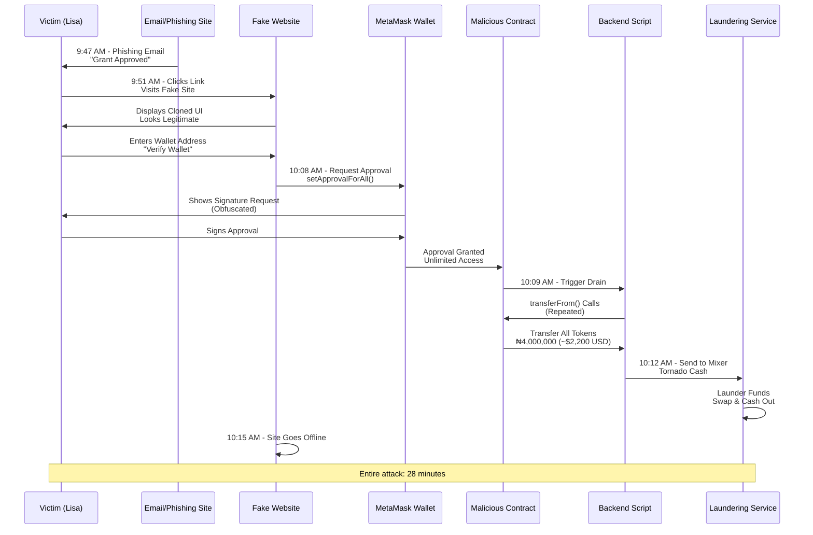

<Info>
**Category**: [Hacks](/safety-education/categories/hacks) → Phishing & Typosquatting + Wallet Drainers

<Badge color="red" size="sm">Hacks</Badge> <Badge color="blue" size="sm">Phishing & Typosquatting</Badge> <Badge color="blue" size="sm">Wallet Drainers</Badge>

**Reading time**: 12 minutes  
**Risk level**: Critical  
**Target audience**: Founders, SMBs, grant applicants, ops teams
</Info>

## Meet Lisa

Lisa is a 32-year-old business owner running two successful e-commerce ventures in Ife, Nigeria. She manages crypto wallets for business operations, pays international contractors in stablecoins, and actively applies to Web3 accelerators and grant programs to fund expansion. She's careful about security—or so she thought.

She uses MetaMask for her wallets, follows crypto news, and knows the basics of DeFi. But like many business owners, she's busy. She manages multiple applications across different programs simultaneously, so when grant emails come in, she doesn't always verify every detail before clicking.

## What Happened

### The Hook

On a Tuesday morning at 9:47 AM, Lisa receives an email in her business inbox:

**Subject:** "Congratulations! Ammatina Fund Grant Approved – Action Required"

The email looks professional:
- Correct Ammatina Fund logo (top left)
- Proper business formatting
- Reference to the grant tier she applied for ("Growth Stage – $25,000")
- Urgent but professional tone

Lisa had applied to Ammatina three weeks earlier through their official website. She was hopeful but skeptical about chances. This email came as a surprise but a pleasant one.

The email content:

> "Dear Lisa,
> 
> Congratulations on your application success! Your venture has been selected for a ₦4,500,000 grant ($25,000 USD equivalent) from Ammatina Fund's Growth Stage program.
> 
> **IMPORTANT:** To verify your wallet and disburse funds, you must complete verification within 48 hours. Failure to do so will result in forfeiture of your grant.
> 
> Please click the button below to proceed:
> 
> [VERIFY WALLET & CLAIM GRANT]
> 
> The verification process is simple and takes 2 minutes.
> 
> Best regards,  
> Ammatina Fund Team"

The urgency is deliberate. The 48-hour window pressures Lisa into acting without full verification. Urgency is one of the most effective social engineering tactics.

### Building Trust

Lisa clicks the button.

She's taken to a website. The URL in her browser reads:

> `https://arnrnatina-funds.com/grant-claim`

She doesn't notice the typo:
- Real domain: `ammatina-funds.com`
- Fake domain: `arnrnatina-funds.com`

The extra "r" and the missing "i" are easy to miss, especially on a phone or when skimming quickly. Typosquatting exploits this visual similarity.

The page she lands on looks almost identical to Ammatina's official branding:
- Same green and white color scheme
- Professional layout
- Progress bar showing "Step 1 of 3: Verify Wallet"
- A MetaMask logo and "Connect Wallet" button
- Text explaining: "We use Web3 wallets to ensure secure, decentralized verification"

Everything looks legitimate because the attacker copied Ammatina's design pixel-for-pixel.

### The Trap

Lisa clicks "Connect Wallet."

MetaMask pops up, asking:

> "Do you want to connect your wallet to arnrnatina-funds.com?"

She doesn't carefully read the domain. She's in a hurry and trusts the branding. She clicks "Connect."

MetaMask displays her account address and asks which account to connect. She selects her Business Wallet B (the one with ₦4.5M in stablecoins and some ETH for operations).

The fake website now shows:

> "Step 2 of 3: Verify Ownership"
> 
> "To prove you own this wallet, please sign the following message."

A MetaMask signature request appears:

> "Sign this message to verify your wallet ownership and process your grant disbursement."

The message content is a hexadecimal-looking string that looks like standard blockchain gibberish. Lisa doesn't read it carefully—most users don't. She clicks "Sign."

**Critical mistake:** What Lisa actually signed was not just a harmless message. She signed a transaction that called `setApprovalForAll()` on her ERC-20 tokens, granting unlimited transfer rights to a smart contract controlled by the attacker.

The fake website now displays:

> "Step 3 of 3: Processing Disbursement"
> 
> "Your grant is being processed. Funds will arrive in your wallet within 3-5 business days."

It shows a fake progress bar and a reassuring message. Lisa feels her anxiety ease. The process felt legitimate, and now she's just waiting.

### The Theft

She never had to provide her seed phrase or private key. But it didn't matter.

At 10:34 AM—just 47 minutes after she signed—her wallet receives a notification:

**Outbound Transaction 1:** ₦1,200,000 USDC to `0x4c2b...` (unknown address)

**Outbound Transaction 2:** ₦950,000 USDT to `0x4c2b...` (unknown address)

**Outbound Transaction 3:** ₦1,850,000 in ETH/other tokens to `0x4c2b...` (unknown address)

Within 90 seconds, the attacker's script has executed three transfers totaling ₦4,000,000 (~$2,200 USD).

All transactions were executed using the approval Lisa signed. She authorized them by clicking "Sign."

The fake grant portal now displays an error message and goes offline. The domain stops responding.

**Total loss: ₦4,000,000** — nearly all of Business Wallet B's operational funds.

Her business cannot make payroll. Supplier payments are missed. One of her ventures is forced to shut down temporarily.

---

## Where the Scammer Won

<Warning>
1. **Email impersonation:** The email looked professional and referenced legitimate details about her actual application.
2. **Typosquatted domain:** `arnrnatina-funds.com` (with extra letters) instead of `ammatina-funds.com`. The visual similarity is intentional.
3. **Cloned UI:** The website's design matched Ammatina's branding perfectly, lowering her skepticism.
4. **Approval obfuscation:** The MetaMask signature request looked like a simple "prove ownership" message. The hexadecimal content appeared to be blockchain standard. Lisa didn't know she was granting unlimited token access.
5. **Urgency and authority:** The "48-hour deadline" pressured quick action. Ammatina's official branding and professional tone seemed authoritative.
6. **No visible warning:** MetaMask showed the signature request but didn't clearly warn that she was approving unlimited spending. This is a known UX gap that drainer attacks exploit.
</Warning>

---

## What Lisa Could Have Done (Prevention)

### Before Clicking the Email Link

<Check>**Never click links in emails for financial actions.** Instead, go directly to the official website by typing the URL manually in your browser.</Check>

<Check>**Verify sender email domain.** Check that the email came from `@ammatina.com` or an officially listed domain, not from a generic provider like Gmail or an unknown address.</Check>

<Check>**Check for grants on the official website.** If Lisa had logged into ammatina-funds.com directly (not via email link), she would have seen her grant status in her account dashboard.</Check>

### Before Connecting Your Wallet

<Check>**Verify the URL carefully:** Type it slowly and check the domain spelling. `arnrnatina` vs. `ammatina` is easy to miss, but critical.</Check>

<Check>**Use a bookmark:** For any site you visit repeatedly, bookmark it on your first visit. Then always use the bookmark, never links in emails.</Check>

<Check>**Hover over links before clicking:** In emails, hover over links to see the real URL. If it doesn't match the stated destination, don't click.</Check>

<Check>**Use browser security tools:** Some wallets and browser extensions (e.g., MetaMask phishing detector, Rabby Wallet) flag known phishing sites. These aren't perfect but help.</Check>

### Before Signing Any Request

<Check>**Read what you're signing.** Modern wallets and plugins (Rabby, Fire Wallet, MetaMask Snaps with simulators) can show you what a transaction actually does in human-readable language.</Check>

<Check>**Assume "sign to verify" is dangerous.** If a site asks you to sign anything, stop and verify it's a legitimate action.</Check>

<Check>**Real verification usually involves a one-time code, not a blockchain signature.**</Check>

<Check>**If they require a signature, use a wallet with transaction simulation to see what it's really doing.**</Check>

<Check>**Never approve "unlimited" spending.** Even if a dApp legitimately needs an approval, set a specific limit (e.g., the exact amount of tokens you're trading), not unlimited.</Check>

<Check>**Check the contract address.** If MetaMask shows you're approving a contract, verify it's the official contract for the protocol. Use BscScan or EtherScan to search the contract address and confirm it's legitimate.</Check>

### Best Practice: Hot vs. Cold Wallet

<Check>**Use a "hot wallet" (small amount) for connecting to unknown or new sites.** Keep operational funds here: ₦100K–₦500K for daily use.</Check>

<Check>**Use a hardware wallet or multisig for bulk holdings.** Most of Lisa's ₦4.5M should have been in a device that requires physical confirmation for transactions, not a software wallet vulnerable to web exploits.</Check>

<Check>**Test withdrawals before depositing large amounts.** If Lisa had sent a small test amount (₦50K) first and requested a test withdrawal, she would have discovered the scam before losing everything.</Check>

---

## Red Flags Lisa Missed

<Warning>
- [ ] **Email urgency:** "Action required within 48 hours." Legitimate programs don't lock access with artificial deadlines.
- [ ] **Typosquatted domain:** `arnrnatina-funds.com` vs. `ammatina-funds.com`. The extra characters were easy to miss.
- [ ] **Domain not matching email sender:** The email claimed to be from Ammatina, but the link went to a different domain (if she had checked).
- [ ] **Signature request during "verification":** Legitimate identity verification doesn't use blockchain signatures.
- [ ] **Hex content in signature:** The signature message looked like random blockchain data instead of readable English. This should have triggered caution.
- [ ] **No reference to specific wallet:** Real grant programs might reference your submitted wallet address. This portal didn't.
- [ ] **Vague next steps:** "Processing. Funds in 3-5 days." Real platforms show transaction hashes, block explorers, or specific status.
</Warning>

---

## If You Already Signed/Approved

<Steps>
  <Step title="Revoke Approvals Immediately">
    Use Revoke.cash or your blockchain explorer:
    - Go to Revoke.cash (or EtherScan's token approve function).
    - Connect your wallet.
    - Find the malicious contract approval (usually labeled as "Unlimited" or with a huge allowance).
    - Click "Revoke" and confirm the transaction.
    - This action costs a small gas fee but prevents further drains.
  </Step>
  
  <Step title="Move Remaining Funds Quickly">
    Create a fresh wallet with a new seed phrase. Send all remaining tokens to the new wallet. Do this immediately before the attacker finds another vector.
  </Step>
  
  <Step title="Preserve Evidence">
    Screenshots of the fake website. The phishing email (including headers if possible). Transaction hashes from the blockchain (showing the drain). URLs and domain registrations.
  </Step>
  
  <Step title="Report">
    The domain: Report to ChainAbuse (chainabuse.com) with the fake domain URL and wallet addresses. Your bank/exchange: If you funded the wallet via a local transfer, report the transaction to your bank (they may flag the receiving account). Law enforcement: File a report with your country's cybercrime unit (Nigeria: EFCC, efcc.gov.ng). The real Ammatina Fund: Email their official support to warn them of the phishing campaign.
  </Step>
  
  <Step title="Do NOT Pay Recovery Scammers">
    Within days, you may receive DMs offering to "recover" your funds for a fee. These are secondary scams (see [Recovery Scam Trap](/safety-education/articles/recovery-scam-trap)). Ignore them completely.
  </Step>
</Steps>

---

## How the Scam Actually Worked (Technical Breakdown)

**The attack combines:**

1. **Email spoofing/phishing:** A convincing email that impersonates Ammatina Fund.
2. **Domain typosquatting:** A domain registration (`arnrnatina-funds.com`) that looks similar to the real one.
3. **UI cloning:** A website that perfectly copies Ammatina's design.
4. **Malicious smart contract:** A contract designed to be called via `setApprovalForAll()`.
5. **Approval obfuscation:** The MetaMask signature request makes the actual approval operation invisible to the user.
6. **Automated drainage:** Once approved, a backend script calls `transferFrom()` repeatedly to move all ERC-20 tokens.
7. **Laundering:** The stolen tokens are moved through mixers (Tornado Cash, TornadoRouter) or immediately swapped to other coins, then cashed out at decentralized exchanges.

**Attack Sequence:**

**Timeline:**
- Email sent at 9:47 AM
- User clicks at 9:51 AM
- User signs approval at 10:08 AM
- Script executes drain at 10:09 AM
- Tokens moved to mixer at 10:12 AM
- Website goes offline at 10:15 AM

The entire attack takes 28 minutes from first click to completion.

---

## Action Steps: Protect Yourself

### Prevention

<AccordionGroup>
  <Accordion title="Type URLs Manually" icon="keyboard">
**Rule:** Type URLs manually from official documentation, not email links.
  </Accordion>

  <Accordion title="Use Bookmarks" icon="bookmark">
**Rule:** Use bookmarks for sites you visit repeatedly.
  </Accordion>

  <Accordion title="Enable Wallet Transaction Simulation" icon="flask">
**Rule:** Enable wallet transaction simulation (Rabby, Fire Wallet, or MetaMask Snaps) to see what you're actually approving.
  </Accordion>

  <Accordion title="Set Token Approval Limits" icon="ban">
**Rule:** Set token approval limits to specific amounts, never "unlimited."
  </Accordion>

  <Accordion title="Use Hardware Wallet or Multisig" icon="shield">
**Rule:** Use a hardware wallet or multisig for majority holdings.
  </Accordion>

  <Accordion title="Test Withdrawals" icon="flask">
**Rule:** Test withdrawals before depositing large sums into unfamiliar platforms.
  </Accordion>

  <Accordion title="Separate Hot and Cold Wallets" icon="wallet">
**Rule:** Hot: Only what you need for daily operations (software wallet, MetaMask). Cold: Bulk holdings (hardware wallet like Ledger, Trezor, or multisig).
  </Accordion>
</AccordionGroup>

### Incident Response (If It Happens)

<Steps>
  <Step title="Revoke Approvals Immediately">
    Use Revoke.cash or EtherScan's token approval tool.
  </Step>
  
  <Step title="Create a New Wallet">
    Create a new wallet with a fresh seed phrase.
  </Step>
  
  <Step title="Move Remaining Funds">
    Move remaining funds to the new wallet (may be too late, but worth doing).
  </Step>
  
  <Step title="Preserve All Evidence">
    Screenshots, URLs, transaction hashes, emails.
  </Step>
  
  <Step title="Report">
    Report to ChainAbuse, your bank, and law enforcement.
  </Step>
  
  <Step title="Inform Your Team/Family">
    Inform your team/family so they don't fall for the same scam.
  </Step>
  
  <Step title="Do NOT Pay Recovery Scammers">
    Do not pay recovery scammers.
  </Step>
</Steps>

### For Businesses

<Check>**Multisig for treasury:** All significant transactions require 2–3 signers.</Check>

<Check>**Approval audit schedule:** Quarterly review and revocation of old approvals.</Check>

<Check>**Wallet access controls:** Use hardware wallets or cold storage for operational funds above a threshold.</Check>

<Check>**Team training:** Educate team members on phishing, typosquatting, and approval risks.</Check>

<Check>**Email filtering:** Set up DMARC/SPF to filter spoofed emails from legitimate domains.</Check>

---

## Real-World Context

<CardGroup cols={2}>
  <Card title="Typosquatting Prevalence" icon="link">
    Over 6,000 typosquatted domains per major brand per year. Attackers register domains with single-character changes, homoglyph swaps, or hyphenation.
  </Card>
  
  <Card title="Drainer Losses (2024)" icon="dollar-sign">
    MS Drainer and similar contracts stole $59M+ from users before the contract operators were identified and arrested by law enforcement.
  </Card>
  
  <Card title="Phishing in Crypto" icon="chart-line">
    Over 40% of user-initiated crypto losses involve phishing or fake websites.
  </Card>
  
  <Card title="Approval Vulnerabilities" icon="alert-triangle">
    Unlimited token approvals are a known attack vector, with millions of users inadvertently granting access to malicious contracts.
  </Card>
</CardGroup>

---

## Related Resources

<CardGroup cols={2}>
  <Card 
    title="Typosquatting Deep-Dive" 
    icon="magnifying-glass"
    href="/safety-education/articles/typosquatting-domains"
  >
    Understand all the domain mimicry patterns and detection tools
  </Card>
  
  <Card 
    title="NFT Mint Drainer" 
    icon="image"
    href="/safety-education/articles/nft-drainer-mint"
  >
    Similar wallet drainer tactic targeting NFT collectors
  </Card>
  
  <Card 
    title="Hacks Category" 
    icon="shield"
    href="/safety-education/categories/hacks"
  >
    Explore all types of technical exploits and phishing
  </Card>
  
  <Card 
    title="Check Your Wallet" 
    icon="shield-check"
    href="https://haveibeendrained.org"
  >
    See if addresses you interacted with are reported
  </Card>
</CardGroup>

---

## References

1. Chainalysis - Crypto Drainers: How to Spot Them
2. Check Point Research - Wallet Scam: A Case Study in Crypto Drainer Tactics
3. Trust Wallet - Typosquatting in Crypto, Explained
4. CYFIRMA - Typosquatting Unmasked
5. KuCoin - Uniswap Phishing Scam: How a Fake Signature Drained a Wallet
