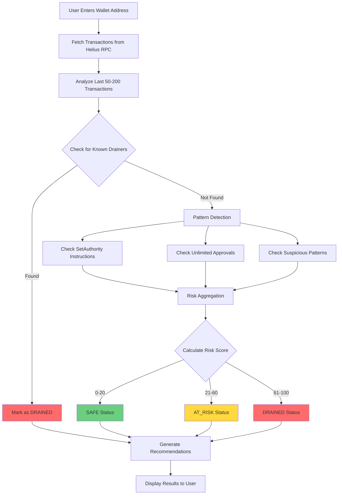

## How to Check Your Wallet

### Using the Website

1. **Navigate to the homepage** at [haveibeendrained.org](https://haveibeendrained.org)
2. **Enter your wallet address** in the search field
3. **Click "Check Wallet"** to start the analysis
4. **Wait for results** (typically 10-15 seconds)

### Using Solana Actions (Blinks)

You can also check wallets directly from Twitter, Discord, or other platforms using Solana Actions:

1. **Share or click a wallet address** in a supported platform
2. **Click the "Check with Have I Been Drained" action**
3. **View results** without leaving the platform

<Note>
  Solana Actions (Blinks) are currently in development and will be available soon.
</Note>

## What Happens During Analysis?

The wallet analysis process follows this flow:

<AccordionGroup>
  <Accordion title="Transaction Fetching">

    We fetch your wallet's recent transaction history from the Solana blockchain using Helius RPC. We typically analyze the last 50-200 transactions.

  </Accordion>

  <Accordion title="Pattern Detection">

    Our detection engine analyzes transactions for:
    - Known drainer addresses
    - SetAuthority instructions
    - Unlimited token approvals
    - Suspicious transaction patterns

  </Accordion>

  <Accordion title="Risk Aggregation">

    All detected threats are aggregated into a single risk score (0-100) and overall status (SAFE, AT_RISK, or DRAINED).

  </Accordion>

  <Accordion title="Recommendations">

    Based on detected threats, we provide actionable recommendations to secure your wallet.

  </Accordion>
</AccordionGroup>

## Understanding the Analysis Time

Analysis typically takes **10-15 seconds** because:

- We fetch transaction history from the blockchain
- We parse and analyze each transaction
- We check against our on-chain drainer registry
- We aggregate risk factors and generate recommendations

<Warning>
  If analysis takes longer than 30 seconds, there may be an issue. Try refreshing the page or contact support.
</Warning>

## Tips for Best Results

- **Use the full wallet address** - Don't use shortened or truncated addresses
- **Check regularly** - New threats can appear at any time
- **Review recommendations** - Even if your wallet is safe, review best practices
- **Report drainers** - Help protect others by reporting malicious addresses

## Troubleshooting

<AccordionGroup>
  <Accordion title="Analysis fails or times out">

    - Check your internet connection
    - Verify the wallet address is correct (base58 format, 32-44 characters)
    - Try again in a few minutes
    - Contact support if the issue persists

  </Accordion>

  <Accordion title="Results seem incorrect">

    - Make sure you're checking the correct wallet address
    - Some threats may be very recent and not yet detected
    - Check the transaction history links provided in results
    - Report any false positives to help improve our detection

  </Accordion>

  <Accordion title="Wallet address not recognized">

    - Ensure you're using a valid Solana wallet address
    - Check for typos or extra spaces
    - Verify the address format (should start with a letter or number)

  </Accordion>
</AccordionGroup>

