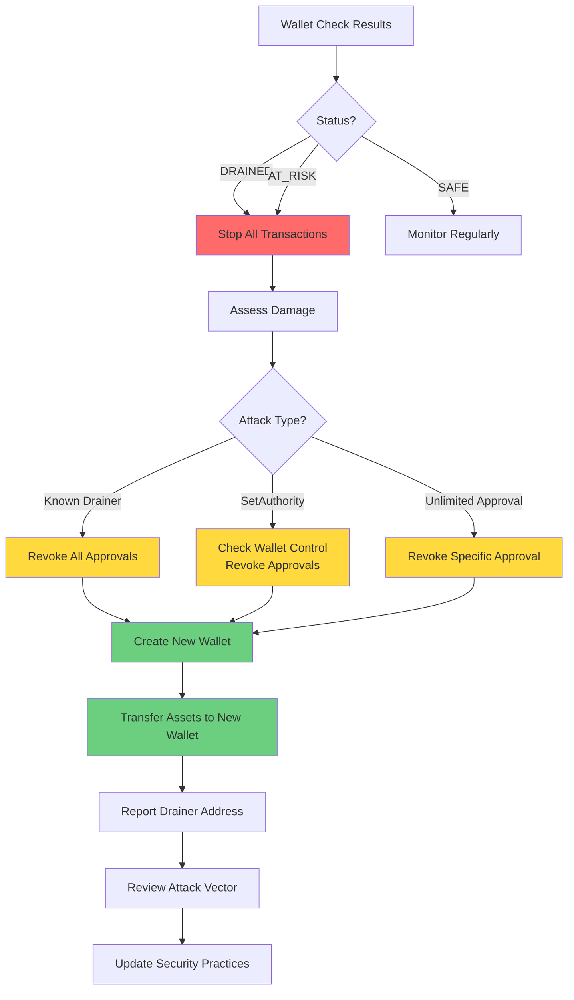

## Immediate Actions

If your wallet shows as **DRAINED** or **AT_RISK**, follow these steps immediately:

**Recovery Decision Flow:**

<Steps>
<Step title="Stop using the wallet">

**Do not** make any new transactions from the compromised wallet. This includes:
- Sending tokens
- Approving new transactions
- Interacting with dApps
- Any blockchain activity

</Step>

<Step title="Assess the damage">

Review the analysis results to understand:
- Which assets were affected
- When the compromise occurred
- What type of attack happened
- Transaction evidence links

</Step>

<Step title="Revoke all approvals">

Revoke all token approvals immediately:

1. Go to [Solana Token Approvals](https://solscan.io/token-approval-checker)
2. Enter your wallet address
3. Revoke all active approvals
4. Use [Revoke.cash](https://revoke.cash) for additional tools

<Warning>
  Revoking approvals may cost a small amount of SOL in transaction fees. This is necessary to prevent further theft.
</Warning>

</Step>

<Step title="Transfer remaining assets">

If any assets remain:
1. Create a **new wallet** (Phantom, Solflare, etc.)
2. Transfer all remaining assets to the new wallet
3. Do not reuse the compromised wallet

</Step>

<Step title="Report the drainer">

Help protect others by reporting the drainer:
1. Go to the [Report Drainer](/user-guide/reporting-drainers) page
2. Submit the drainer address
3. Provide transaction evidence

</Step>
</Steps>

## Recovery by Attack Type

### Known Drainer Attack

**What happened:** Your wallet interacted with a known drainer address.

**Recovery steps:**
1. Immediately revoke all approvals
2. Transfer any remaining assets
3. Create a new wallet
4. Report the drainer address
5. Review how the interaction occurred (phishing, malicious dApp, etc.)

### SetAuthority Attack

**What happened:** An unauthorized authority change was detected.

**Recovery steps:**
1. **Critical:** Revoke all token approvals immediately
2. Check if you can still control the wallet
3. Transfer assets to a new wallet
4. Review recent transactions to find the attack vector
5. Change all related passwords and keys

### Unlimited Approval Attack

**What happened:** A token approval with unlimited spending was granted.

**Recovery steps:**
1. Revoke the unlimited approval immediately
2. Check if tokens have been drained
3. If tokens remain, transfer them to a new wallet
4. Review which dApp or transaction granted the approval
5. Avoid that dApp/service in the future

## Creating a New Wallet

<AccordionGroup>
  <Accordion title="Using Phantom">

    1. Download Phantom wallet extension
    2. Create a new wallet (do not import the old one)
    3. Write down your seed phrase securely
    4. Transfer assets from the compromised wallet
    5. Update all dApp connections to use the new wallet

  </Accordion>

  <Accordion title="Using Solflare">

    1. Download Solflare wallet
    2. Create a new wallet
    3. Securely store your recovery phrase
    4. Transfer remaining assets
    5. Update all service connections

  </Accordion>

  <Accordion title="Hardware Wallet">

    For maximum security, consider using a hardware wallet:
    1. Purchase a Ledger or Trezor
    2. Set up a new Solana account
    3. Transfer assets to the hardware wallet
    4. Use hardware wallet for all future transactions

  </Accordion>
</AccordionGroup>

## Preventing Future Attacks

### Best Practices

1. **Never share your private key or seed phrase**
2. **Verify dApp URLs** before connecting
3. **Use specific amount approvals** instead of unlimited
4. **Review transactions regularly**
5. **Use hardware wallets** for large holdings
6. **Check wallet security** periodically with Have I Been Drained

### Approval Management

- **Revoke unused approvals** regularly
- **Use specific amounts** when approving
- **Set expiration dates** if supported
- **Monitor approval activity**

### Transaction Verification

- **Verify all transaction details** before signing
- **Check recipient addresses** carefully
- **Be cautious of unexpected transactions**
- **Review transaction history** regularly

## Getting Help

If you need assistance:

1. **Check our documentation** - Review all guides
2. **Contact support** - Email support@haveibeendrained.org
3. **Report issues** - Help improve our detection
4. **Community forums** - Connect with other users

<Info>
  We cannot recover stolen assets, but we can help you understand what happened and prevent future attacks.
</Info>

## Legal Considerations

If significant assets were stolen:

1. **Document everything** - Save transaction evidence
2. **Report to authorities** - File a police report if needed
3. **Contact exchanges** - If assets were sent to exchange addresses
4. **Seek legal advice** - For large losses

## Emotional Support

<Note>
  Being a victim of a wallet drain can be stressful. Remember:
  - You're not alone - many others have experienced this
  - It's not your fault - attackers are sophisticated
  - Focus on prevention - learn from the experience
  - Take your time - recovery is a process
</Note>

